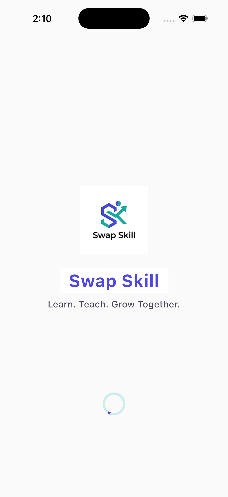
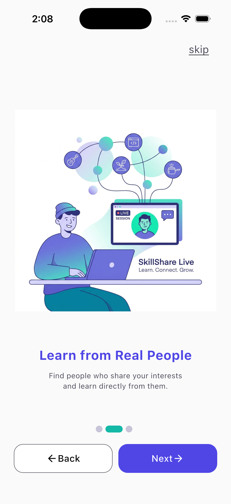
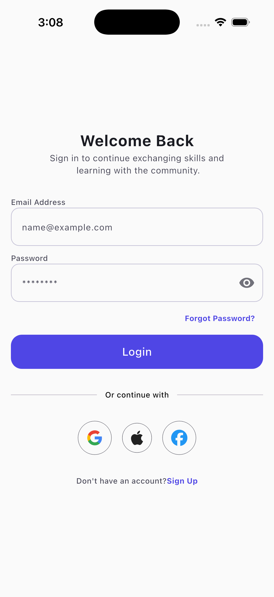
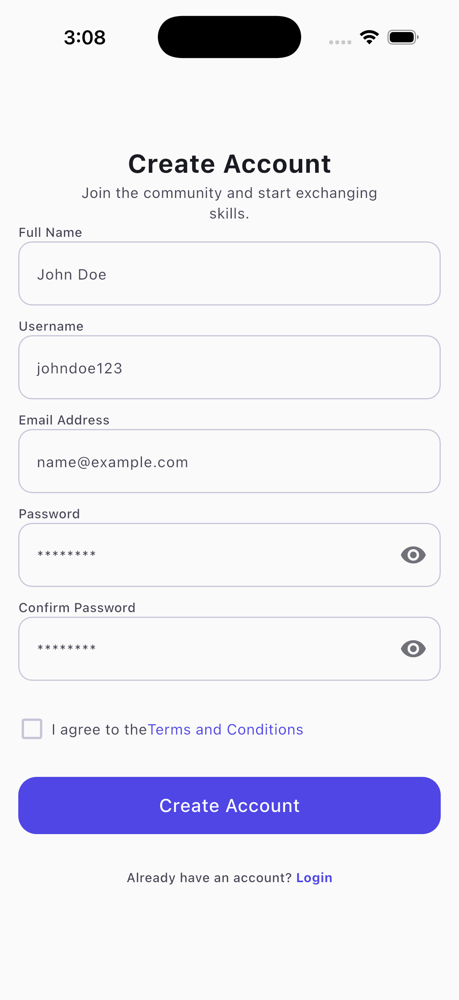

# Swap Skill

Swap Skill is a Flutter application that connects people who want to learn new skills by exchanging knowledge with others.

Users can create a profile, share the skills they can teach, and choose the skills they want to learn. The app matches users with similar interests, making it easy to connect, communicate, and grow together through skill exchange.

## App Preview

### Splash Screen

### Onboarding

### Login

### Sign Up
